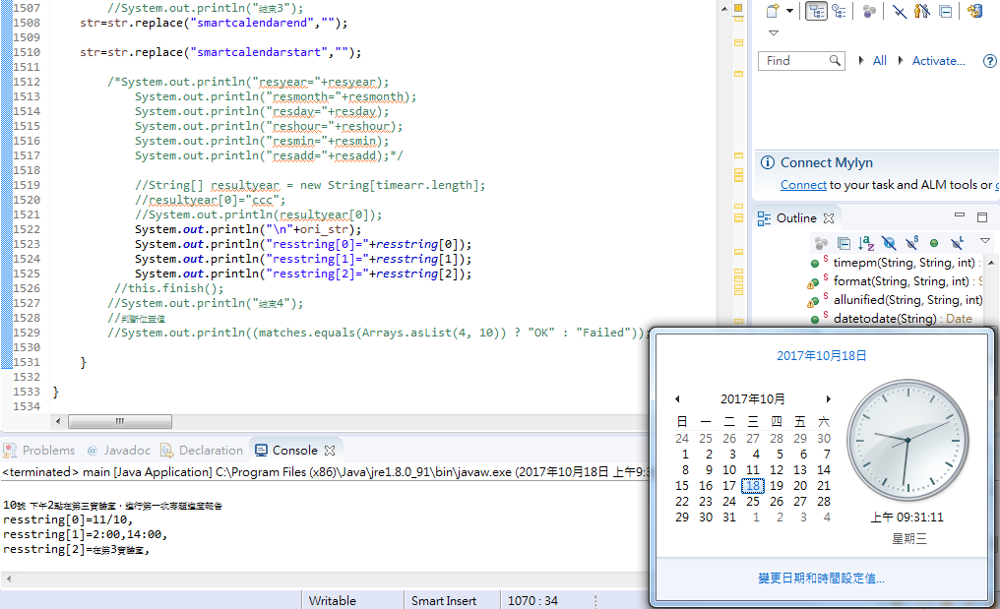

#StringMatcher

文字的日期比對

***

建立文字搜尋方法

將中文數字轉換成阿拉伯數字

轉換日期成統一格式

轉換上下午為統一格式

建立關鍵字及相關格式

進行日期搜尋，如果沒有則進入周間搜尋

進行時間搜尋

進行地點搜尋

***
目前已知問題

非標準格式日期及時間做比對會產生例外處理但不會導致程式崩潰

關於地點搜尋則是抓取關鍵字後的5個字，已先做地點處理的擴充準備